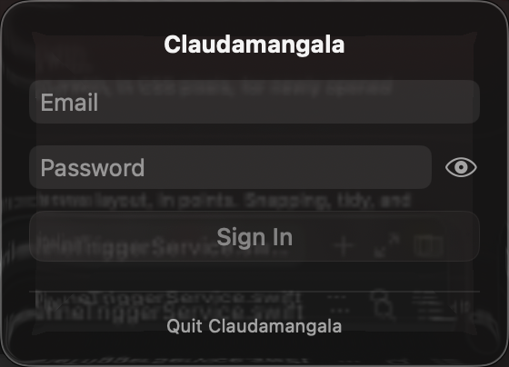
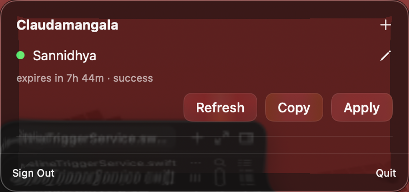
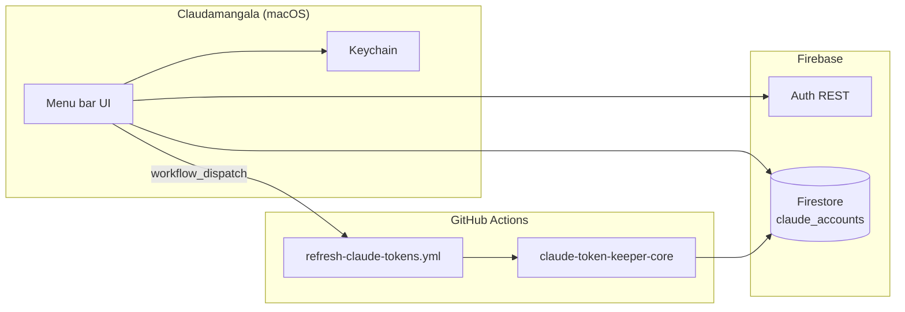

<p align="center">
  
</p>

# Claudamangala

A native **macOS menu-bar app** for managing Claude Code OAuth accounts stored in **Firebase Firestore**. Sign in, view token expiry, switch accounts to your Mac Keychain, copy credentials, or trigger a per-account refresh via GitHub Actions.

<p align="center">
  
  &nbsp;&nbsp;
  
</p>

## Features

- **Claude spark branding** — official Anthropic spark in the menu bar (transparent) and on the app icon
- **Firebase sign-in** — email/password auth via REST (no Firebase SDK keychain issues on unsigned builds)
- **Live account list** — polls Firestore every 5 seconds for expiry and refresh status
- **Apply** — replaces the active `claudeAiOauth` Keychain entry on this Mac
- **Copy** — copies `{"claudeAiOauth":{...}}` JSON to the clipboard
- **Refresh** — dispatches the public [`claudes-plan`](https://github.com/TheGuyDangerous/claudes-plan) workflow for a single account
- **Rename / Add** — inline panels (no sheets — works reliably inside `MenuBarExtra`)
- **Glass UI** — compact ~400px popup, no system blue accent

## Architecture



| Piece | Repo / service |
|-------|----------------|
| Menu-bar app | **this repo** |
| Public cron + manual dispatch | [`TheGuyDangerous/claudes-plan`](https://github.com/TheGuyDangerous/claudes-plan) |
| Refresh scripts + Firestore rules | [`TheGuyDangerous/claude-token-keeper-core`](https://github.com/TheGuyDangerous/claude-token-keeper-core) (private) |
| Account storage | Firestore `claude_accounts` collection |

## Requirements

- macOS 14+
- Xcode 15+ (for local builds)
- [XcodeGen](https://github.com/yonaskolb/XcodeGen) (`brew install xcodegen`)
- A Firebase project with Email/Password auth and Firestore enabled
- Pipeline already seeded (`app_config/pipeline` + GitHub `WORKFLOW_DISPATCH_SECRET`)

## Local setup

### 1. Clone and generate the Xcode project

```bash
git clone https://github.com/TheGuyDangerous/Claudamangala.git
cd Claudamangala
xcodegen generate
./scripts/generate-icons.sh
open Claudamangala.xcodeproj
```

### 2. Add Firebase config

Download `GoogleService-Info.plist` from the Firebase console and place it at:

```
Claudamangala/GoogleService-Info.plist
```

Use `Claudamangala/GoogleService-Info.plist.example` as a template. **Never commit the real file.**

### 3. Add pipeline dispatch config

Copy the example and fill in your GitHub PAT + dispatch secret:

```bash
cp Claudamangala/PipelineConfig.plist.example Claudamangala/PipelineConfig.plist
```

| Key | Description |
|-----|-------------|
| `githubOwner` / `githubRepo` | Public workflow repo (e.g. `TheGuyDangerous` / `claudes-plan`) |
| `workflowFile` | `refresh-claude-tokens.yml` |
| `dispatchToken` | Fine-grained PAT with **Actions: write** on the public repo |
| `dispatchSecret` | Must match GitHub secret `WORKFLOW_DISPATCH_SECRET` |

`PipelineConfig.plist` is gitignored and bundled into the app at build time.

### 4. Build and run

```bash
xcodebuild -scheme Claudamangala -configuration Debug build
open ~/Library/Developer/Xcode/DerivedData/Claudamangala-*/Build/Products/Debug/Claudamangala.app
```

Look for the **orange Claude spark** in the menu bar — no background box, just the mark on the system bar.

## CI — build a DMG

On tag push `v*.*.*` or manual **workflow_dispatch**, [`.github/workflows/build-dmg.yml`](.github/workflows/build-dmg.yml) builds a Release `.dmg` artifact.

Set these repository secrets:

| Secret | Value |
|--------|-------|
| `GOOGLE_SERVICE_INFO_PLIST_BASE64` | `base64 -i Claudamangala/GoogleService-Info.plist` |
| `PIPELINE_CONFIG_PLIST_BASE64` | `base64 -i Claudamangala/PipelineConfig.plist` |

The DMG is **ad-hoc signed, not notarized**. First launch: right-click → **Open**.

## Sharing with friends

1. Create a Firebase Auth user for them (Email/Password).
2. Publish Firestore rules that let authenticated users read/write `claude_accounts` (see `claude-token-keeper-core/firestore.rules`).
3. Send them the built `.dmg` plus their login credentials.
4. They add accounts from their own Keychain via the **+** button.

## Refresh flow

1. User taps **Refresh** on an account row.
2. App POSTs to GitHub `workflow_dispatch` with `account_id` + `dispatch_secret`.
3. App polls Firestore for changes to `expiresAt`, `lastRefreshStatus`, and `lastRefreshedAt`.
4. Spinner stops on `success` or `skipped`.

## Project layout

```
Claudamangala/
├── Assets.xcassets/            # AppIcon + MenuBarIcon (from Resources/*.svg)
├── Resources/
│   ├── claude-logo.svg         # Menu bar spark (transparent)
│   └── app-icon.svg            # Dock icon (spark on dark tile)
├── ClaudamangalaApp.swift      # MenuBarExtra + MenuBarIcon
├── Views/                      # SwiftUI screens
├── ViewModels/                 # Auth + accounts state
├── Services/                   # Firebase REST, Firestore, pipeline, Keychain
├── GoogleService-Info.plist    # gitignored — Firebase web API key
└── PipelineConfig.plist        # gitignored — GitHub dispatch credentials

docs/
├── menubar-icon.png            # Transparent Claude spark (README + reference)
├── claude-spark.svg            # Shared spark source
├── app-icon.png                # Exported AppIcon preview
└── screenshots/                # README UI captures
```

## Regenerating icons & docs assets

Source SVGs live in `Claudamangala/Resources/`. Requires `brew install librsvg`.

```bash
./scripts/generate-icons.sh
```

This updates `Assets.xcassets` and syncs `docs/menubar-icon.png`, `docs/app-icon.png`, and `docs/claude-spark.svg`.

## Regenerating screenshots

```bash
chmod +x scripts/capture-screenshots.sh
./scripts/capture-screenshots.sh
```

Grant **Accessibility** and **Screen Recording** to Terminal when prompted.

## License

MIT — use at your own risk. OAuth tokens are sensitive; only share the app with people you trust. Claude® and the Claude spark are trademarks of Anthropic; this is an unofficial private tool.
