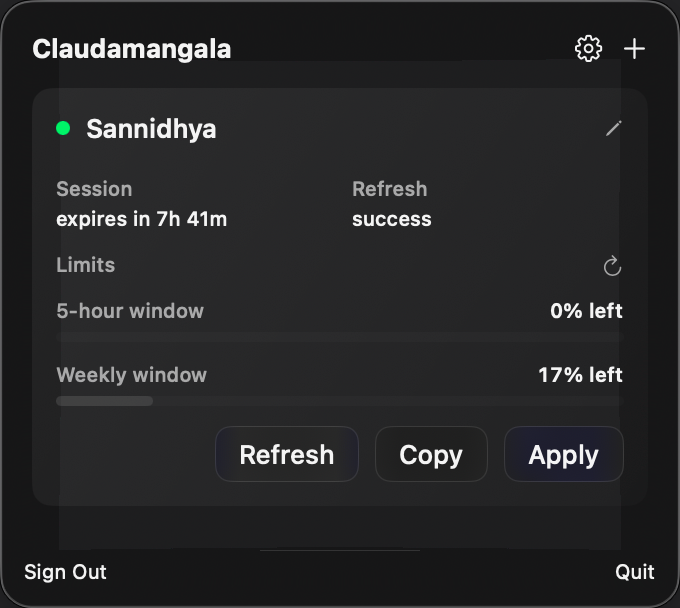
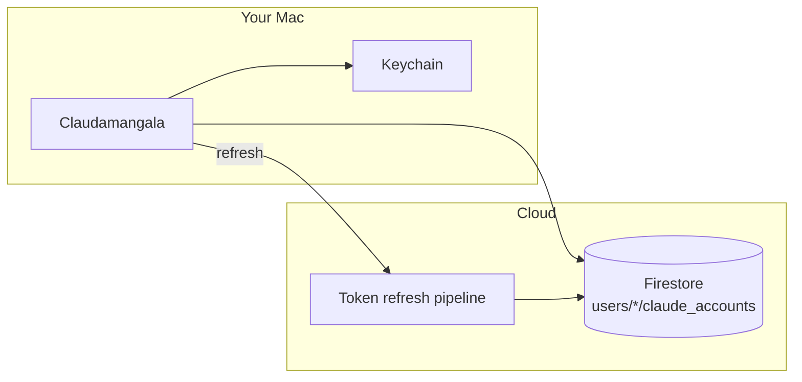
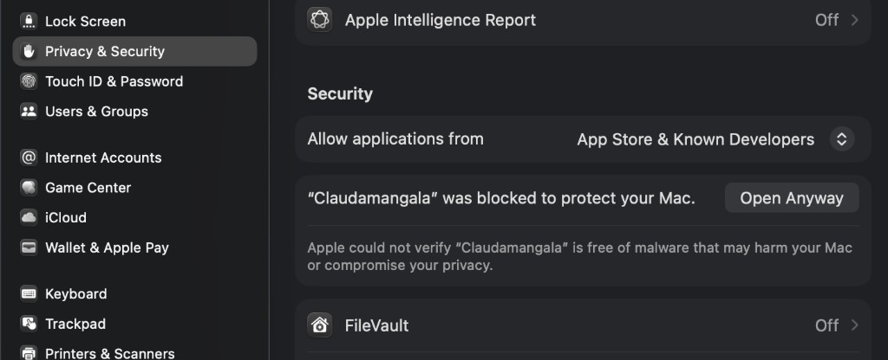

<p align="center">
  
</p>

# Claudamangala

A native **macOS menu-bar app** for managing Claude Code OAuth accounts stored in **Firebase Firestore**. Sign in, view token expiry, switch accounts to your Mac Keychain, copy credentials, or request a per-account token refresh.

<p align="center">
  
</p>

## Features

- **Claude spark branding** — spark mark in the menu bar (transparent) and on the app icon
- **Firebase sign-in** — email/password auth via REST (no Firebase SDK keychain issues on unsigned builds)
- **Live account list** — polls Firestore every 5 seconds for expiry and refresh status
- **Apply** — replaces the active `claudeAiOauth` Keychain entry on this Mac
- **Copy** — copies `{"claudeAiOauth":{...}}` JSON to the clipboard
- **Refresh** — asks a remote pipeline to refresh one account on demand
- **Rename / Add** — inline panels (no sheets — works reliably inside `MenuBarExtra`)
- **Launch at login** — optional toggle in Preferences
- **Auto-update** — checks GitHub Releases for a newer DMG and can install to Applications
- **Scheduled local refresh** — optional 1h / 2h / 4h / 6h automatic token refresh while the app is running
- **Glass UI** — compact ~400px popup, no system blue accent

## How it fits together



| Piece | Role |
|-------|------|
| **Claudamangala** | Menu-bar UI — sign in, list accounts, apply / copy / refresh |
| **Firestore** | Per-user nested accounts (`users/{uid}/claude_accounts`) |
| **Refresh pipeline** | Background job that keeps OAuth tokens fresh (hosted separately; you configure it once) |

## Requirements

- macOS 14+
- Xcode 15+ (for local builds)
- [XcodeGen](https://github.com/yonaskolb/XcodeGen) (`brew install xcodegen`)
- A Firebase project with Email/Password auth and Firestore enabled
- A refresh pipeline + Firestore `app_config` already set up for your project (not part of this repo)

## Local setup

### 1. Clone and generate the Xcode project

```bash
git clone <repo-url>
cd Claudamangala
xcodegen generate
./scripts/generate-icons.sh
open Claudamangala.xcodeproj
```

### 2. Add Firebase config

Download `GoogleService-Info.plist` from the Firebase console and place it at:

```
Claudamangala/GoogleService-Info.plist
```

Use `Claudamangala/GoogleService-Info.plist.example` as a template. **Never commit the real file.**

### 3. Add pipeline config

Copy the example and fill in the values whoever operates the refresh pipeline gives you:

```bash
cp Claudamangala/PipelineConfig.plist.example Claudamangala/PipelineConfig.plist
```

| Key | Description |
|-----|-------------|
| `githubOwner` / `githubRepo` | Host for the refresh automation trigger |
| `workflowFile` | Workflow filename on that host |
| `defaultBranch` | Branch to target |
| `dispatchToken` | API token allowed to start a refresh run |
| `dispatchSecret` | Shared secret the pipeline checks on manual refresh |

`PipelineConfig.plist` is gitignored and bundled into the app at build time.

### 3b. Add OAuth config (local token refresh)

Copy the example and fill in the Claude OAuth client settings (not committed to the public repo):

```bash
cp Claudamangala/OAuthConfig.plist.example Claudamangala/OAuthConfig.plist
```

| Key | Description |
|-----|-------------|
| `clientId` | OAuth client ID used by Claude Code token refresh |
| `tokenEndpoint` | HTTPS URL for the OAuth token exchange |

`OAuthConfig.plist` is gitignored and bundled into release builds. Signed-in users can also load the same values from Firestore `app_config/oauth` if the plist is absent.

### 4. Build and run

```bash
xcodebuild -scheme Claudamangala -configuration Debug build
open ~/Library/Developer/Xcode/DerivedData/Claudamangala-*/Build/Products/Debug/Claudamangala.app
```

Look for the **orange Claude spark** in the menu bar.

## Building a DMG (optional)

Tag push `v*.*.*` or a manual run of [`.github/workflows/build-dmg.yml`](.github/workflows/build-dmg.yml) can produce a Release `.dmg`.

Set these repository secrets on **this** repo:

| Secret | Value |
|--------|-------|
| `GOOGLE_SERVICE_INFO_PLIST_BASE64` | `base64 -i Claudamangala/GoogleService-Info.plist` |
| `PIPELINE_CONFIG_PLIST_BASE64` | `base64 -i Claudamangala/PipelineConfig.plist` |
| `OAUTH_CONFIG_PLIST_BASE64` | `base64 -i Claudamangala/OAuthConfig.plist` |

The DMG is **ad-hoc signed, not notarized**. macOS may block the first launch.

**Option A — right-click:** Applications → **Claudamangala** → right-click → **Open** → confirm **Open**.

**Option B — System Settings:** If you only see “Move to Bin”, open **System Settings → Privacy & Security** and click **Open Anyway**:

<p align="center">
  
</p>

You only need to do this once per Mac.

## Sharing with friends

1. Create a Firebase Auth user for them (Email/Password).
2. **Publish Firestore rules** from [`firestore.rules`](firestore.rules) (each user only sees documents where `ownerUid` matches their Firebase UID).
3. Send a built `.dmg` with `GoogleService-Info.plist` and `PipelineConfig.plist` already bundled, plus their login.
4. They add accounts from their own Keychain via the **+** button — new documents are tagged with their `ownerUid` automatically.

Each user has `users/{uid}/claude_accounts/*`. The GitHub Actions refresh job still refreshes all active accounts (Admin SDK bypasses rules).

### Migrating existing documents

Before publishing the new rules, stamp `ownerUid` on documents that predate per-user isolation:

```bash
cd claude-token-keeper-core
GOOGLE_APPLICATION_CREDENTIALS=path/to/serviceAccountKey.json \
  node scripts/migrate-owner-uid.mjs --dry-run

GOOGLE_APPLICATION_CREDENTIALS=path/to/serviceAccountKey.json \
  node scripts/migrate-owner-uid.mjs

node scripts/deploy-firestore-rules.mjs
```

Default owner UID is the project owner (`tRrq8mT9vaVVacjbo5OPHFMK53L2`). Pass `--owner-uid` to assign docs to another Firebase user.

**Cloud refresh (owner only):** Claudamangala shows Local/Cloud manual refresh only if Firestore rules grant read access to `app_config/pipeline`. Add another UID there to grant cloud refresh — no app rebuild required.

**OAuth endpoint:** The token refresh URL and client ID are not in source code. They ship inside the DMG via `OAuthConfig.plist` and/or Firestore `app_config/oauth` (readable by signed-in users only).

## Refresh flow

1. User taps **Refresh** on an account row.
2. App sends a signed refresh request to the configured pipeline host.
3. App polls Firestore for changes to `expiresAt`, `lastRefreshStatus`, and `lastRefreshedAt`.
4. Spinner stops on `success` or `skipped`.

## Project layout

```
Claudamangala/
├── Assets.xcassets/            # AppIcon + MenuBarIcon
├── Resources/                  # Logo SVG sources
├── ClaudamangalaApp.swift      # MenuBarExtra entry
├── Views/                      # SwiftUI screens
├── ViewModels/                 # Auth + accounts state
├── Services/                   # Firebase REST, Firestore, pipeline, Keychain
├── GoogleService-Info.plist    # gitignored — Firebase config
├── PipelineConfig.plist        # gitignored — refresh trigger config
└── OAuthConfig.plist           # gitignored — OAuth client + token endpoint

docs/
├── menubar-icon.png
├── claude-spark.svg
├── app-icon.png
└── screenshots/
    ├── app.png
    └── Claudamangala-block_2026-08-17_06-38-04.png
```

## Regenerating icons & docs assets

Requires `brew install librsvg`.

```bash
./scripts/generate-icons.sh
```

## Regenerating screenshots

```bash
chmod +x scripts/capture-screenshots.sh
CLAUDAMANGALA_EMAIL=you@example.com CLAUDAMANGALA_PASSWORD=secret ./scripts/capture-screenshots.sh
```

Optional env vars sign in before capture. Grant **Accessibility** and **Screen Recording** to Terminal when prompted.

---

<p align="center">
  <sub>© 2026 Sannidhya Dubey · <a href="LICENSE">Proprietary License</a> · Personal, non-commercial use only</sub>
</p>
